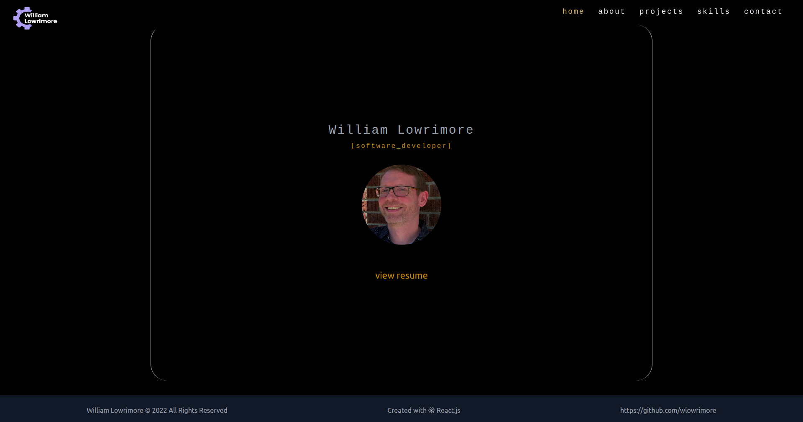
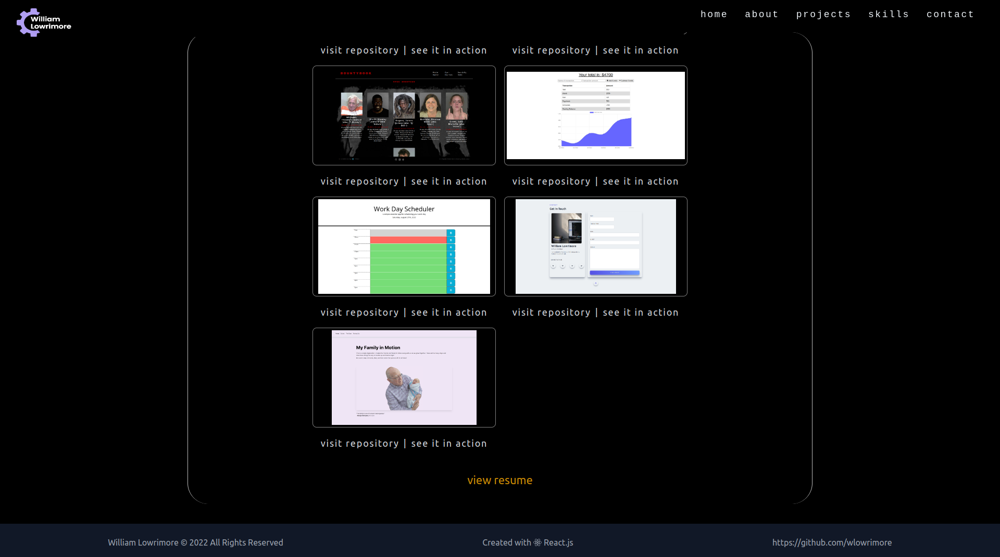

# WILLIAM LOWRIMORE | SOFTWARE DEVELOPER | DIGITAL PORTFOLIO

This project was bootstrapped with [Create React App](https://github.com/facebook/create-react-app).

This is a [TailwindCSS](https://tailwindcss.com) styled project, and does include some Vanilla CSS as well.

## OVERVIEW
This Portfolio was built using ReactJS and TailwindCSS.  It is a simple SPA with complete mobile responsiveness.  I chose React, because all though I am a certified full stack developer, my interest lies heavily on front-end design.  The layout is simple, yet effective.  Everything you need to know about who I am and how I code is in these files.  A subtle color scheme with just the right contrast makes for a pleasant viewing experience.  I used the react-router-dom approach for clean and persice routing functionality.  TailwindCSS is my favorite!  Tailwind makes it super easy to create a 'mobile first' application while adding more eyepleasing pleasantries to the application. Finally, in the Contact portion of the application, you will find a message form.  This form was made possible by the awesom people at [Getform](https://getform.com).  Please take a moment to check them out.

## INSTALLATION
No need to install this app on your machine.  Just visit: [my personal site](https://williamlowrimore.com) to view it in a live, fully deployed environment!

## DEPLOYMENT
This application is deployed and hosted by [Vercel](https://vercel.com/docs/concepts/deployments/overview).

## CONTACT INFORMATION
* email: [wlowrimore@gmail.com](mailto:wlowrimore@gmail.com) 
* website: [williamlowrimore.com](https://williamlowrimore.com) 
* linkedIn: [www.linkedin.com](https://linkedin.com/in/william-lowrimore-21778310)